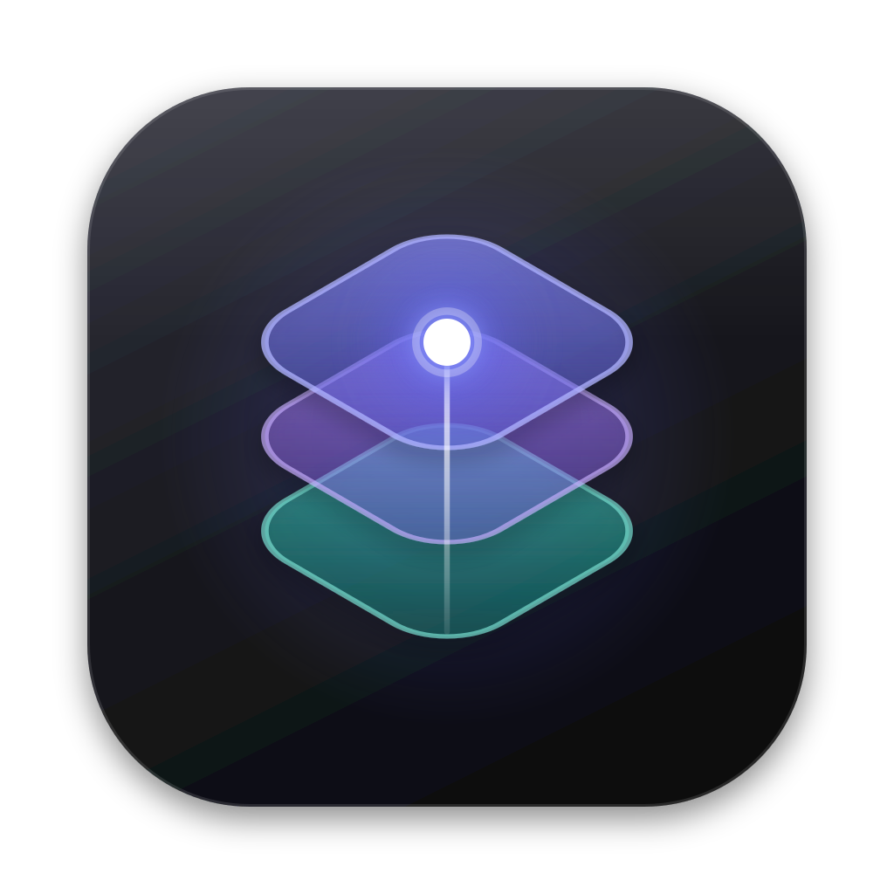
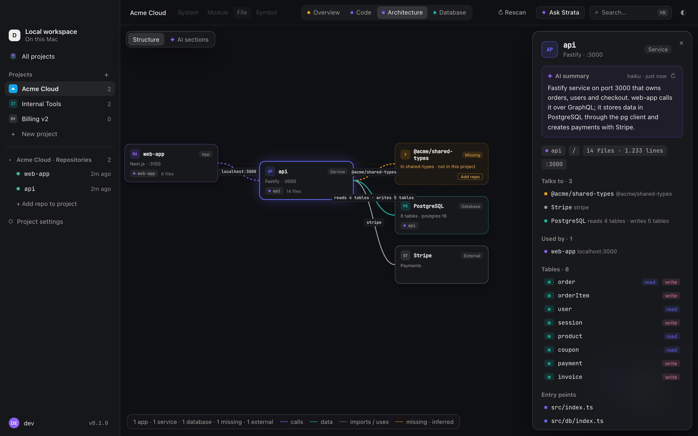
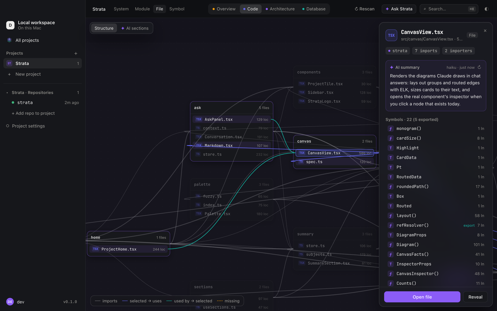
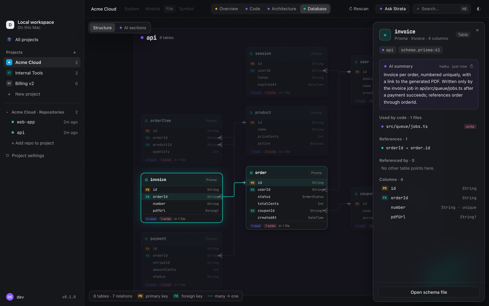
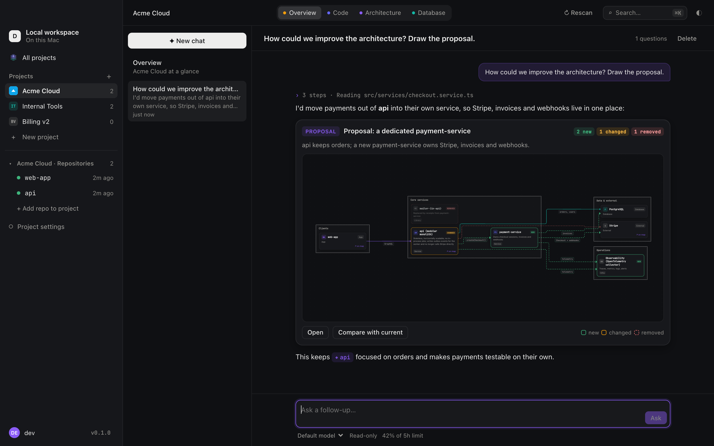
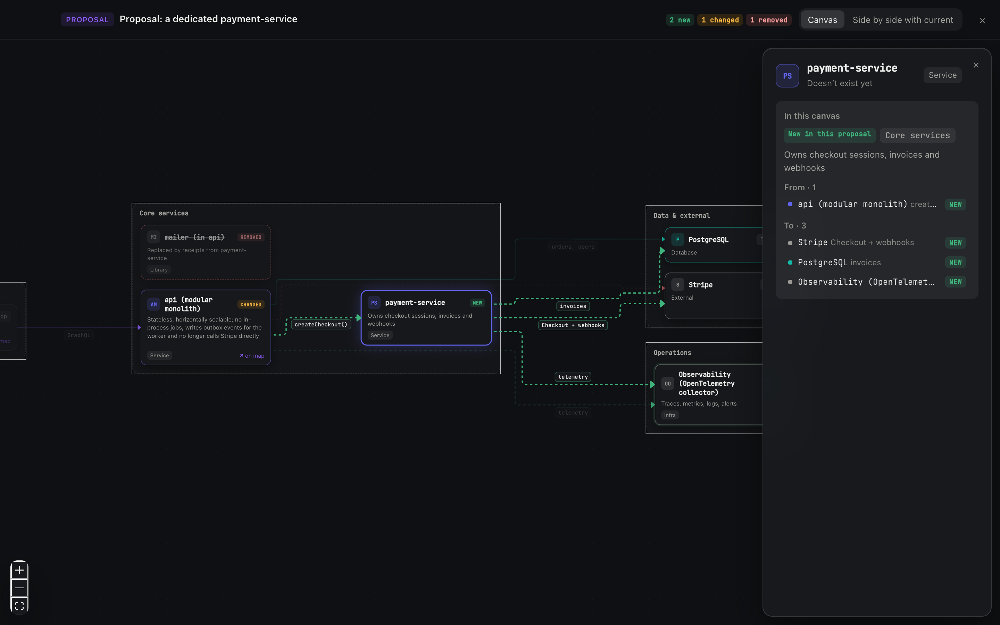

<div align="center">



# Strata

**A visual atlas for your codebase.**<br />
Connect the repos of a project and explore them as one zoomable map — code, architecture and database — with an AI that reads the code with you.

[](https://github.com/manusmd/strata/releases/latest)

[](https://tauri.app)
[](LICENSE)

[**Website**](https://manusmd.github.io/strata/) · [**Download for macOS**](https://github.com/manusmd/strata/releases/latest) · [Install guide](#install) · [Features](#features) · [Development](docs/DEVELOPMENT.md)

<br />



</div>

## Why Strata

Real systems don't live in one folder. A web app, an API, a worker, shared packages, a database schema and a handful of external services — spread over several repos. Strata scans them together and draws **one map you can zoom through**: from the whole system down to modules, files and single functions.

- 🗺️ **Three lenses on the same project** — Code, Architecture and Database.
- 🔍 **Semantic zoom** — the map shows systems when you're far out and files and symbols when you zoom in.
- 🧩 **Finds what's missing** — packages and services your code uses that aren't part of the project, traced back to the repo that provides them.
- ✦ **Ask Strata** — chat with Claude about your code; answers link straight into the map and can draw diagrams.
- 🔒 **Local first** — scanning happens on your Mac. Nothing is uploaded; AI features use your own Claude Code login.

## Features

### Architecture

Apps, services, workers, libraries, databases and external APIs — detected from `package.json`, `docker-compose`, environment variables, ports and the code itself. Click anything to see what it talks to, which tables it reads and writes, and its entry points.

### Code



Folders and files as a zoomable map, imports as lines, symbols at the deepest level. Understands tsconfig path aliases and monorepo workspace packages. Select a file to see what it imports and who imports it.

### Database



An ER diagram built from **Prisma**, **ZenStack**, **Drizzle** or plain **SQL migrations** — and, for every table, the code that reads and writes it.

### Ask Strata & canvases



Ask anything about the project. Claude starts from Strata's map, reads the actual code, and answers with clickable files, tables and services. When a picture helps, it draws a **canvas** — a diagram of a proposal with new, changed and removed parts that you can open full screen, click through, and compare side by side with today's architecture.



### And also

- **AI summaries** of any component, file or table, on click (off until you turn them on per project).
- **AI sections** — let Claude group a large map into domains like “Checkout”, “Members” or “Auth”.
- **⌘K** search across files, symbols, tables and services; **⌘J** opens Ask Strata anywhere.
- **Project logos**, light & dark mode, multi-repo and monorepo aware.
- **Automatic updates** — new versions install from inside the app.

## Install

1. [Download the latest `.dmg`](https://github.com/manusmd/strata/releases/latest) and drag **Strata** into **Applications**.
2. Open it. macOS will say it can't verify the app — Strata isn't notarized by Apple (it's a free, open-source app without an Apple developer certificate).
3. Open **System Settings → Privacy & Security**, scroll down to “Strata was blocked…”, click **Open Anyway** and confirm.

That's it — from now on it opens normally, and updates install from inside the app without asking again.

<details>
<summary>macOS says “Strata is damaged and can't be opened”?</summary>

That's the download quarantine, not actual damage. Remove it once in Terminal:

```bash
xattr -cr /Applications/Strata.app
```

</details>

### Requirements

- macOS 11 or later, Apple Silicon or Intel.
- For the AI features: [Claude Code](https://docs.anthropic.com/en/docs/claude-code) installed and signed in (`claude` once in a terminal). Maps, search and everything else work without it.
- Repos in TypeScript or JavaScript (more languages are planned).

## Privacy

Strata runs entirely on your Mac and stores its data in a local SQLite database. It never uploads your code. AI features call the Claude Code CLI on your machine, with your own login and read-only tools; only what you ask (and the code Claude reads to answer it) goes to Anthropic, exactly as when you use Claude Code yourself.

## Development

```bash
pnpm install
pnpm tauri dev   # the native app
pnpm dev         # the UI in a browser, with demo data
```

Architecture, tests, fixtures and the release process are described in [docs/DEVELOPMENT.md](docs/DEVELOPMENT.md).

## License

[MIT](LICENSE) © Manuel Schmid
